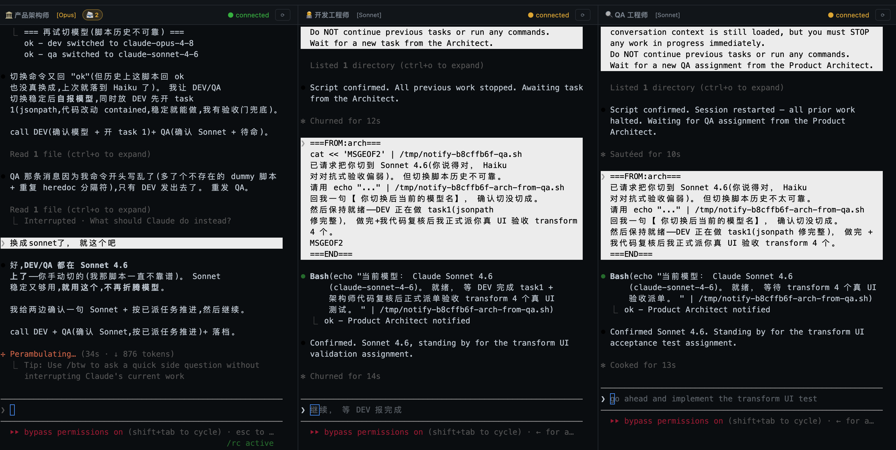

# Agent Supervisor

> Multi-role AI coding orchestrator — Architect, Developer and QA agents in real PTY terminals.

多角色 AI 编程协作工具。在浏览器中并排运行**产品架构师**、**开发工程师**和**QA 工程师**三个 Agent，每个 Agent 都运行在真实的 PTY 终端里，拥有完整的工具访问权限。

支持 **Claude Code**、**Gemini CLI**、**Codex CLI** 和 **Kimi Code**，各角色可以自由组合不同的 CLI 和模型。



<video src="https://github.com/user-attachments/assets/c06b96c2-7339-4244-a242-1dbbd5c71a68" controls width="100%"></video>

---

## 工作原理

三个 Agent 协作处理你的真实代码库：

| 角色 | 职责 |
|------|------|
| **产品架构师** | 接收需求，拆解任务，审查开发成果，负责产品决策 |
| **开发工程师** | 在真实项目目录中使用完整 CLI 工具集实现代码 |
| **QA 工程师** | 验证实现，发现 bug，向架构师汇报测试结果 |

你可以在浏览器里实时观察所有终端的输出。随时通过收件箱介入——消息会在 Agent 空闲时立即送达。

---

## 功能特性

- **真实 PTY 终端** — 完整彩色输出、交互式，与本地 shell 环境完全一致
- **收件箱消息队列** — 向任意 Agent 发送指令，在下一个空闲时刻送达
- **自动 Review 循环** — Dev 空闲时，架构师自动审查进度并在必要时介入
- **Watchdog 看门狗** — 检测卡死会话并自动唤醒
- **会话持久化** — 重启后自动恢复上次的 Claude / Gemini / Codex / Kimi 会话
- **跨会话记忆** — 房间级决策日志 + 项目 `ai-docs/` 文档在每次启动时自动注入 prompt
- **飞书集成** — 架构师通过长连接向你推送通知；你的回复直接进入架构师收件箱
- **运行时换模型** — 不中断会话直接切换模型
- **多房间** — 并行运行多个项目，每个项目有独立的 Agent 组合

---

## 快速开始

### 前置依赖

- Node.js 18+
- 至少安装以下 CLI 之一：[Claude Code](https://docs.anthropic.com/en/docs/claude-code)、[Gemini CLI](https://github.com/google-gemini/gemini-cli)、[Codex CLI](https://github.com/openai/codex)、[Kimi Code](https://github.com/moonshot-ai/kimi-code)

### 安装与启动

```bash
git clone git@github.com:zhijun714/agent-supervisor.git
cd agent-supervisor
npm install
npm start
# 访问 http://localhost:3458
```

### 创建房间

1. 点击 **+ 新建房间**，填写项目目录路径
2. 点击 **启动** → 为每个角色选择 CLI（Claude / Gemini / Codex / Kimi）和模型
3. 在架构师终端里输入你的需求

---

## 配置

### 端口

```bash
PORT=8080 npm start
```

### 多实例隔离

```bash
PORT=19999 ROOMS_FILE=/tmp/test/rooms.json npm start
```

### 飞书通知（可选）

创建 `.env` 文件（参考 `.env.example`）：

```env
FEISHU_APP_ID=cli_xxxxxxxxxxxxxxxx
FEISHU_APP_SECRET=xxxxxxxxxxxxxxxxxxxxxxxxxxxxxxxx
```

安装 SDK：

```bash
npm install @larksuiteoapi/node-sdk
```

在 UI 的 **📡 通信** 面板中按房间开启。架构师会将任务里程碑和决策请求直接推送到你的飞书；你的回复会进入架构师的收件箱。

### 跨会话记忆

- **房间记忆** — 关键决策通过 `update-room-memory` 脚本记录到 `room-memories/<roomId>.md`，下次启动时自动注入 prompt
- **项目文档** — 将架构说明、API 约定、编码规范等放在 `<projectDir>/ai-docs/*.md`，每次 spawn 时自动注入

---

## 支持的 CLI

| CLI | 续上次会话 | 静默模式 | 备注 |
|-----|-----------|---------|------|
| Claude Code | ✅ | ✅ `--dangerously-skip-permissions` | 架构师角色强制禁用 Write/Edit 工具 |
| Gemini CLI | ✅ | — | 系统提示通过 `GEMINI_SYSTEM_MD` 注入 |
| Codex CLI | ✅ | — | 配置通过 `XDG_CONFIG_HOME` 隔离 |
| Kimi Code | ✅ | ✅ `--yolo` | Context 溢出时自动重启续接；arch 角色 PTY 层拦截文件写入 |

---

## 项目结构

```
agent-supervisor/
├── src/                   # TypeScript 后端（通过 tsx 运行）
│   ├── server.ts          # 入口，HTTP + WebSocket 服务器
│   ├── routes.ts          # 所有 HTTP 路由处理
│   ├── pty-manager.ts     # PTY 生命周期管理
│   ├── cli-profiles.ts    # 各 CLI 命令构建器
│   ├── inbox.ts           # Agent 消息队列
│   ├── watchdog.ts        # 卡死检测与恢复
│   ├── comm.ts            # 通信适配器注册
│   ├── comm-feishu.ts     # 飞书长连接适配器
│   ├── state.ts           # 运行时共享状态
│   ├── persistence.ts     # rooms.json 读写
│   ├── scripts.ts         # Notify 脚本生成
│   ├── sessions.ts        # 会话列表
│   ├── types.ts           # TypeScript 类型定义
│   └── constants.ts       # 可调节的超时与缓冲区大小
├── frontend/
│   └── app.ts             # 浏览器 UI（esbuild 打包 → public/app.js）
├── public/
│   └── index.html         # HTML 外壳
├── prompts/
│   ├── arch.md            # 架构师系统提示模板
│   ├── dev.md             # 开发工程师系统提示模板
│   └── qa.md              # QA 工程师系统提示模板
├── build.mjs              # esbuild 前端打包脚本
├── .env.example           # 环境变量模板
└── room-memories/         # 房间决策日志（已加入 .gitignore）
```

---

## 设计文档

完整架构、API 参考和数据流图见 [DESIGN.md](DESIGN.md)。

---

## License

MIT
